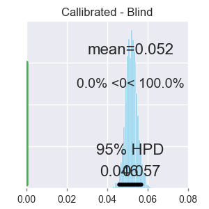
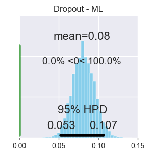
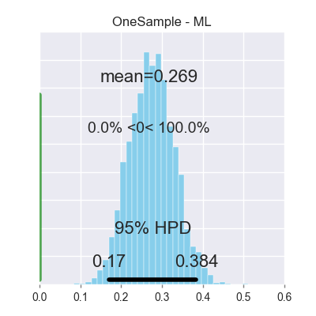
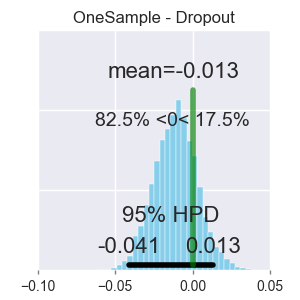
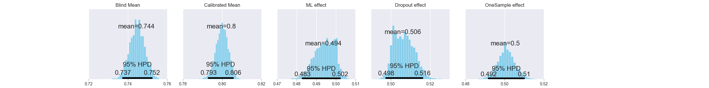
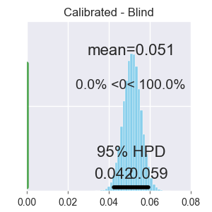
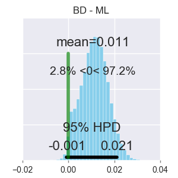
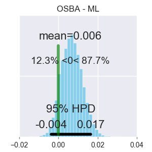
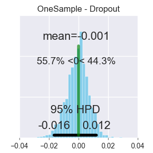

# Known Unknowns: Uncertainty Quality in Bayesian Neural Networks

This repository holds the code for the paper "Known Unknowns: Uncertainty Quality in Bayesian Neural Networks" accepted to the Bayesian Deep Learning Workshop at NIPS 2016.

Arxiv link: https://arxiv.org/abs/1612.01251

We evaluate the uncertainty quality in neural networks using anomaly detection. We extract uncertainty measures (e.g. entropy) from the predictions of candidate models, use those measures as features for an anomaly detector, and gauge how well the detector differentiates known from unknown classes. We assign higher uncertainty quality to candidate models that lead to better detectors. We also propose a novel method for sampling a variational approximation of a Bayesian neural network, called One-Sample Bayesian Approximation (OSBA). We experiment on two datasets, MNIST and CIFAR10. We compare the following candidate neural network models: Maximum Likelihood, Bayesian Dropout, OSBA, and --- for MNIST --- the standard variational approximation. We show that Bayesian Dropout and OSBA provide better uncertainty information than Maximum Likelihood, and are essentially equivalent to the standard variational approximation, but much faster.

## Reproducing results (Python 3.5)

### Installing dependences
```bash
pip install -r requirements.txt
```

### Running an experiment

```bash
python run_experiment.py --dataset=mnist --model=mlp-dropout
```

Available dataset options:
* mnist
* cifar10
* svhn (experimental)

Available model options:
* mlp
* mlp-dropout
* mlp-poor-bayesian
* mlp-bayesian
* convolutional
* convolutional-dropout
* convolutional-poor-bayesian


### Plotting results

```bash
python plots_anova.py --dataset=mnist
```

## ANOVA Results

### MNIST







### CIFAR10 (Updated Results)







